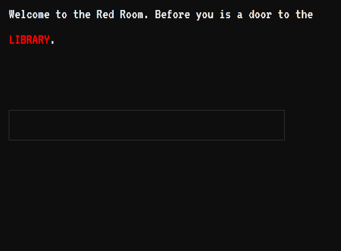

# Text Adventure Command Input macro for SugarCube 2 and Twine



This is a work in progress macro/system to use Twine 2 to make text adventure-style games (Zork etc) where the user types in the action they want to make. 

The macro has the built in defaults actions of: GO, LOOK, TAKE, REMEMBER, USE, DROP, and FORGET, but the user can define custom actions within the passage. The TAKE and REMEMBER actions use The Simple Inventory System by ChapelR for their functionality, so if you want to use them, you should have this macro enabled as well: https://github.com/ChapelR/custom-macros-for-sugarcube-2/blob/master/docs/simple-inventory.md

The code for the command input box itself is adapted from the SugarCube textbox macro

## Usage

### Macro tags and elements

#### Command Input box

Each passage that you want the command input box to appear in needs to have the macro tag:

` <<commandbox $command>>`

This macro only takes one argument, which is the variable name that will be passed through the code to validate whether the command is possible and carry it out if it is. For now, only use the variable shown in the example.

#### Passage Actions Macro tag

For the command box to do anything, you need to define what is actionable in your passage. You do this by setting variables into specifically formatted javascript objects and then passing the variables as arguments through the macro tag:

`<<passageactions $actionableobject1 $actionableobject2>>`

This tag can take as many variables as Actionable Objects you define. It is required for each passage that uses this system. An empty variable will be ignored. How to set the object's options is in the Defining Objects and Actions section below. 

#### Message Box Element

The message box is div you need to include if you want your actions to have any feedback text/messages. So if the user "Looks" at an object, the text will appear in this box. By default the code is this:

`<div id="message-box" style="height: 35px"></div>`

Technically this is optional, but I can't imagine many use cases where you'd leave it out.

### Defining Actions and Objects

Here's the structure with all of the possible options for an Actionable Object:

```javascript
<<set $actionableObject = {
  	name: "it", // String: The name used in text and for inventory
  	keywords: [], // Array : The object's nicknames to identify it in a command
  	possibleActions: {
      go: false, // String : Passage name, doesn't work unless isPassage is true
      look: "Nothing special about it.", // String : Description of what you see
      take: {
        enabled: false, // Boolean : Whether you can take or not
        description: "You take it.", // String : Custom description of taking if enabled is true (optional)
        disabledDescription: "You can't take it.", // String : Custom description if enabled is false, default is false
      },
      remember: {
        description: "You will never forget it.", // String: Message to display when remembering
        inventory: "memorybank",
        runfunction: false, // Function: function to run
      },
      customactions: { // You can have as many as you want
        customaction1: {
          actionkeywords: [], // Array: the actions identifying keywords. Example: ["sniff", "smell", "snort"]
          description: "You do the thing", // String: message to display when triggering action
          runfunction: false // Function: to run
        }
      }
    }
} >>
```

That probably looks like a lot so we'll do some simple examples.

### Default Actions

#### Go

```javascript
<<set $blueroom = {
    name: "The Blue Room",
    keywords: ['the blue room', 'blue room', 'room', 'through door', 'north'],
    possibleActions: {
        go: "blue room",
    }
}>>

<<passageactions $blueroom>>
```

We start by setting the `name`, this is the overall name of the object that the user can perform actions on. It's used by the system and will be the name that will be added to in inventories. In this case, the object is a room/passage, so it should not be added to inventories, unless you're doing something really experimental.

Next is `keywords` which defines every word that user might refer to your object as. The system will search through the user's command for one of these phrases to determine if they want to do something to this object. If you want the user to be able to enter `Go north` or `Go up` etc to go to your room/passage include north/up in your keywords.

`possibleActions` is where you define the actions the user can take on the actionable object. In this case, the object is a room/passage and has the `go` action defined.

`possibleActions > go` is triggered by the word "go" in the user's input. It takes one value, the passage name that it leads to.

#### Look

```javascript
<<set $book = {
    name: 'book',
    keywords: ['book', 'paperback'],
    possibleActions: {
      look: "The book looks heavy, dusty, and old.",
    }
} >>
  
<<passageactions $book>>
```

The `look` action takes only one value which is the text to display when activated on the object. The words `examine` and `check` will also activate this action.

#### Take

```javascript
<<set $dagger = {
    name: 'dagger',
    keywords: ['blade', 'knife'],
    possibleActions: {
      take: {
        enabled: true,
        description: 'You take the dagger. You might need to stab someone, later.',
        disabledDescription: 'The dagger melts into a puddle before your eyes.',
        inventory: "inventory"
      }
    }
} >>

<<passageactions $dagger>>
```

For `take` the first option is `enabled` which determines if you can take the object in the first place. If it's `true` then the `description` text will show after taking. If it's `false` then the `disabledDescription` text will show after attempting to take it.  `inventory` defines the name of the Simple Inventory to use.

#### Remember

```javascript
<<set $photo = {
  	name: "a photo of a man",
    keywords: ['photo', 'picture', 'image'],
    possibleActions: {
      remember: {
        description: "You inspect the photograph. You will never forget those creepy eyes.",
        inventory: "memorybank",
        runfunction: function(){alert("I'll never forget.")}
      }
    }
} >>

<<passageactions $photo>>
```

For the `remember` action there are two options, `description` which is the text that will display after performing the action and `run function` where you can define a javascript function to run when actioning the object. `inventory` defines the name of the Simple Inventory to use, this should be different than the `take` inventory.

#### Use

```javascript
<<set $voodoodoll = {
    name: "a voodoo doll",
    keywords: ['voodoo doll', 'doll'],
    possibleActions: {
      use: {
        dagger: {
          name: "dagger",
          description: "You poke the doll with the dagger. Ouch! It hurts you.",
        },
        book: {
          name: 'book',
          description: "You look up about the doll in the book which tells you it's name is Gary.",
          runfunction: function(){alert("Gary. That's your name!")}
        }
      }
    }
} >>
  
<<passageactions $voodoodoll>>
```

The `use` action allows you to have a valid command with two objects. In an objects you define the other objects available that can be used on it. So if you can use a `dagger` on a`voodoo doll`, then you define the action associated with the `dagger` in the`voodoo doll` options (as shown above). The `dagger` must also be defined as an object in the passage or it will not validate, and the names must match exactly. The `use` account can trigger a `description` and run a function.

#### Drop & Forget

The `DROP` and `FORGET` actions are enabled for every item you can `TAKE` and `REMEMBER` respectively.

### Custom actions

``` javascript
<<set $pie = {
    name: "a cherry pie",
    keywords: ['cherry pie', 'pie', 'tasty pie'],
    possibleActions: {
      customactions: {
        smell: {
          actionkeywords: ["sniff", "smell", "snort"],
          description: "It smells fruity and tasty.",
        },
        eat: {
          actionkeywords: ["eat", "munch", "bite"],
          description: "It's too hot to eat and it scalds your mouth.",
          runfunction: function(){alert("You just lost 2 hit points.")}
        }	
      }
	} >>

<<passageactions $pie>>
```

For `custom actions` you define your own object keys based on the name of the action. You can have as many custom actions defined as you like. In the `action keywords` option, you define the different words the user could use to perform your custom action. `description` sets the text that will display after the user performs the action and `run function` is an optional option that let's you run a function after the user performs the action. 

### Running Functions for Actions  from Story JS

```javascript
/* In your story JS */

setup.yourFunction = function(){
    console.log('This function can be run from from a passage');
}

/* In your passage */
<<set $photo = {
  name: "a photo of a man",
  keywords: ['photo', 'picture', 'image'],
  possibleActions: {
    remember: {
      description: "You inspect the photograph. You will never forget those creepy eyes.",
      inventory: "memorybank",
      runfunction: setup.yourFunction // Here it is!
    }
  }
} >>
  
<<passageactions $photo>>
```

If you want to run a function from your story JS for one of your defined actions, you have to set it up in a special way. Add your function to the `setup` variable and then call it in the action options.

### Configuration

This is a feature that hasn't been added yet.

### Full Passage Code Example

Below is an example of what a passage might look like with this code.

```javascript
You are in a red room. On the table is a cherry pie, a dagger, a book, a voodoo doll, and a photo of a man. There is a blue door that leads to the blue room.

<div id="message-box" style="height: 35px"></div>
<<commandbox "$command">>

<<set $pie = {
    name: "a cherry pie",
    keywords: ['cherry pie', 'pie', 'tasty pie'],
    possibleActions: {
      customactions: {
        smell: {
          actionkeywords: ["sniff", "smell", "snort"],
          description: "It smells fruity and tasty.",
        },
        eat: {
          actionkeywords: ["eat", "munch", "bite"],
          description: "It's too hot to eat and it scalds your mouth.",
          runfunction: function(){alert("You just lost 2 hit points.")}
        }	
      }
} >>
	
<<set $photo = {
		name: "a photo of a man",
    keywords: ['photo', 'picture', 'image'],
    possibleActions: {
      remember: {
        description: "You inspect the photograph. You will never forget those creepy eyes.",
        inventory: "memorybank",
        runfunction: function(){alert("I'll never forget.")}
      }
    }
} >>

<<set $dagger = {
    name: 'dagger',
    keywords: ['blade', 'knife'],
    possibleActions: {
      take: {
        enabled: true,
        description: 'You take the dagger. You might need to stab someone, later.',
        disabledDescription: 'The dagger melts into a puddle before your eyes.',
        inventory: "inventory"
      }
    }
} >>

<<set $book = {
    name: 'book',
    keywords: ['book', 'paperback'],
    possibleActions: {
      look: "The book looks heavy, dusty, and old.",
    }
} >>

<<set $blueroom = {
    name: "The Blue Room",
    keywords: ['the blue room', 'blue room', 'room', 'through door'],
    possibleActions: {
        go: "blue room",
    }
}>>
  
<<set $voodoodoll = {
    name: "a voodoo doll",
    keywords: ['voodoo doll', 'doll'],
    possibleActions: {
      use: {
        dagger: {
          name: "dagger",
          description: "You poke the doll with the dagger. Ouch! It hurts you.",
        },
        book: {
          name: 'book',
          description: "You look up about the doll in the book which tells you it's name is Gary.",
          runfunction: function(){alert("Gary. That's your name!")}
        }
      }
    }
} >>

<<passageactions $pie $photo $book $dagger $blueroom $voodoodoll>>
```

### Persistent Actionable Objects/Inventory Actionable Objects

If you want to add persistent actionable objects that can work on any passage, create a PassageFooter and place them in there with a separate `<<passageactions $var >>` macro tag.

This includes actions on inventory items, so if you have an inventory item that you want actionable (including being able to DROP it or FORGET it) when it's in the inventory use code like this in your PassageFooter. Include a separate `passageactions` inside the `if` statement that checks if each inventory item is in the inventory.

In general, you should make one of these for every inventory item or your game may behave a little strangely.

```javascript
<<if $inventory.has('a cherry pie')>>
<<set $pie = {
    name: "a cherry pie",
    keywords: ['cherry pie', 'pie', 'tasty pie'],
    possibleActions: {
            look: "The pie is a bit squished from being in your pocket.",
			customactions: {
				smell: {
						actionkeywords: ["sniff", "smell", "snort"],
						description: "It smells fruity and tasty.",
						},
				eat: {
						actionkeywords: ["eat", "munch", "bite"],
						description: "It's too hot to eat.",
					}
				}
        	}
	} >>\
  <<passageactions $pie>>\
<</if>>\
```

This action will overwrite any actions already associated with $pie in the current passage, so it's best to use the same variable.

If, alternatively, you DON'T want an object in your inventory to be actionable, set pie to an object with possibleActions empty.

